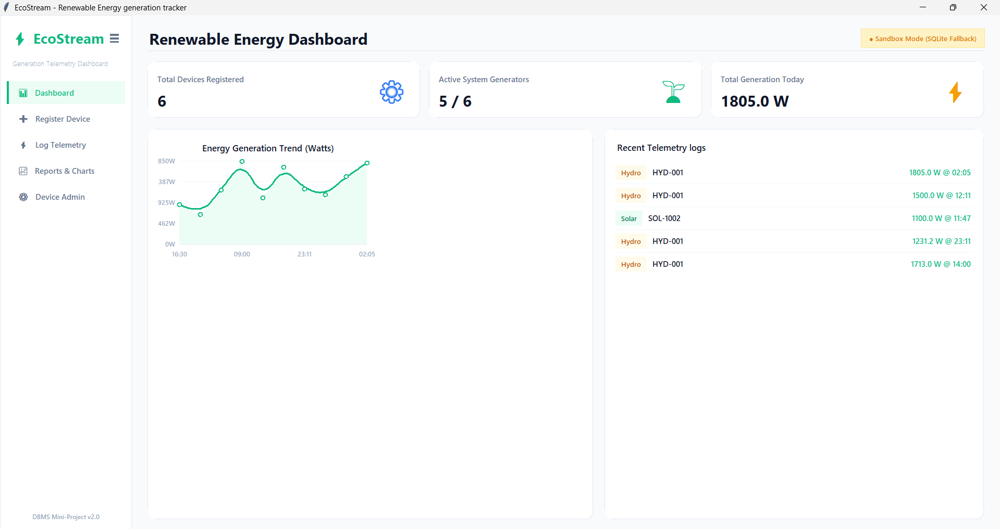

\# EcoStream - Renewable Energy Generation Tracking System

## Dashboard Preview



# ⚡ EcoStream - Renewable Energy Generation Tracking System

## Dashboard Preview


## 📖 Project Overview

EcoStream is a Database Management System (DBMS) mini-project developed to monitor, manage, and analyze renewable energy generation from multiple renewable sources such as Solar, Wind, and Hydro power systems.

The project provides a centralized platform for recording energy generation data, tracking device performance, and generating analytical reports. It demonstrates the practical implementation of core DBMS concepts including relational database design, normalization, primary and foreign keys, triggers, stored procedures, and SQL queries.

The application is developed using Python with a modern Tkinter-based graphical user interface and supports both MySQL and SQLite databases. The system automatically calculates generated power using database triggers and provides detailed reports for efficient energy management.

---

## 🎯 Objectives

* Monitor renewable energy generation from different sources.
* Store and manage device information efficiently.
* Record voltage and current readings from energy devices.
* Automatically calculate generated power using database triggers.
* Generate monthly and device-wise analytical reports.
* Demonstrate practical implementation of DBMS concepts.

---

## ✨ Key Features

### Device Management

* Register Solar, Wind, and Hydro energy devices.
* Update device information.
* Delete inactive devices.
* Track device status and installation details.

### Energy Monitoring

* Log voltage and current readings.
* Automatic power calculation using triggers.
* Real-time power generation tracking.
* Historical energy data storage.

### Reports & Analytics

* Monthly energy generation reports.
* Device-wise performance statistics.
* Energy generation trends and analysis.
* Dashboard KPIs and visual insights.

### Database Features

* Primary Keys and Foreign Keys
* Data Integrity Constraints
* SQL Triggers
* Stored Procedures
* CRUD Operations
* Normalized Database Schema

---

## 🏗️ System Architecture

Device Registration
↓
Energy Data Collection
↓
Database Storage
↓
Power Calculation (Trigger)
↓
Report Generation
↓
Dashboard Visualization

---

## 🗄️ Database Design

### Devices Table

| Attribute         | Description                     |
| ----------------- | ------------------------------- |
| Device_ID         | Unique device identifier        |
| Device_Name       | Name of energy device           |
| Device_Type       | Solar / Wind / Hydro            |
| Location          | Device location                 |
| Installation_Date | Date of installation            |
| Status            | Active / Inactive / Maintenance |

### Energy_Readings Table

| Attribute    | Description               |
| ------------ | ------------------------- |
| Reading_ID   | Unique reading identifier |
| Device_ID    | Reference to device       |
| Voltage      | Voltage reading           |
| Current      | Current reading           |
| Power        | Calculated power          |
| Reading_Time | Timestamp                 |

---

## ⚙️ Technologies Used

* Python 3
* Tkinter GUI
* SQLite
* MySQL
* SQL
* DBMS Concepts
* Triggers
* Stored Procedures

---

## 🚀 How to Run

### Clone Repository

```bash
git clone https://github.com/Abhishekrao123-tech/Renewable-Energy-Generation-Tracking-System.git
```

### Open Project

```bash
cd Renewable-Energy-Generation-Tracking-System
```

### Run Application

```bash
python app.py
```

---

## 📊 DBMS Concepts Implemented

* Entity Relationship Model
* Relational Schema Design
* Normalization (1NF, 2NF, 3NF)
* Primary Keys
* Foreign Keys
* SQL Queries
* Joins
* Aggregate Functions
* Triggers
* Stored Procedures
* CRUD Operations

---

## 👥 Team Members

* Abhishek Rao
* V. Achyutha Krishna Reddy
* Rajendra
* Arjo Bakshi

---

## 🎓 Academic Information

**Project Type:** DBMS Mini Project
**Department:** Computer Science Engineering
**Academic Year:** 2025–2026

---

## 📄 License

This project is developed for educational and academic purposes.
